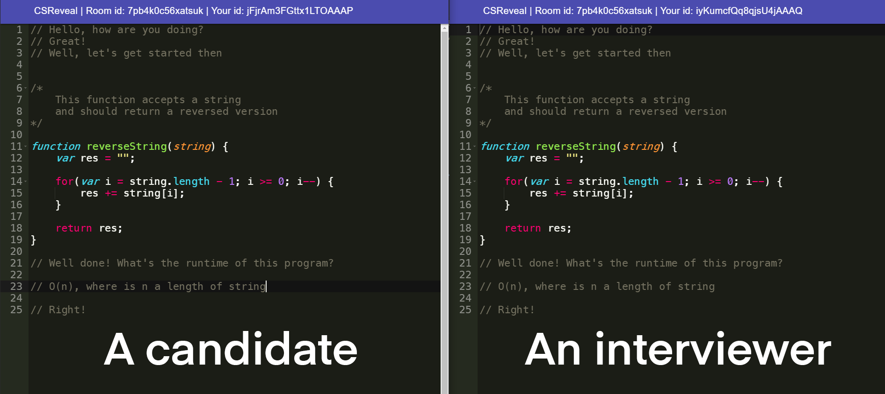

# CSReveal

app like coderpad.io, where you can join a room and  share your coding knowledge and the other person will see it (like an interactive coding interview)

# Challenges
- [ ] - Compiler. For now it's just a showcase of any solution to the problem. But how can you test it? Need a compiler! Well, will think about it's implementation!
- [x] - Server Crashes. Solved 50 / 50. Sometimes it crashes when you refresh a page too fast, that's why I have `setTimeout()` function. I think socket.io and Express.js collide a little bit.
- [ ] - Talking. It would be nice to implement some kind of chatting. So you wouldn't need another app for voice communication.
- [ ] - Better design. Well, I like Material Design for this project, but I just need to design index page better. For now it looks dull (just some text and button). Maybe a video on the background would work.
- [ ] - Multilanguage support. For now you can choose Java or JS when creating a room. But again, there should be a compiler for each language.

